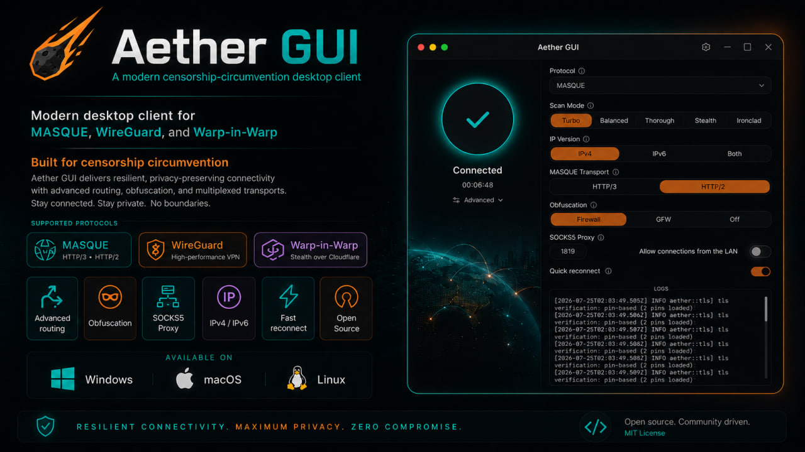

# Aether-modified

This is a modified version of [MatinSenPai/Aether-GUI](https://github.com/MatinSenPai/Aether-GUI)
with an optional **Final proxy** setting, including support for WireGuard connections.
Traffic using the app's local SOCKS5 listener follows this order:
**your application → Aether/WireGuard → your remote proxy → website**.
The final proxy supports SOCKS5 or HTTP CONNECT, with optional username/password
authentication. This mode forwards TCP; a final-proxy failure stops the connection.

See [FINAL-PROXY.md](FINAL-PROXY.md) for setup and build instructions, and
[VERIFICATION.md](VERIFICATION.md) for test results and remaining validation limits.
The desktop application retains the upstream Aether-GUI name.

[](https://github.com/ella4moon/Aether-modified/actions/workflows/build.yml)
[](LICENSE)


**English** · [فارسی](README_fa.md)

A one-click desktop GUI for [**Aether**](https://github.com/CluvexStudio/Aether), a censorship-circumvention tunnel built for heavily restricted networks. Aether itself is a terminal tool: it discovers a working route out, establishes an encrypted tunnel, and exposes a local SOCKS5 proxy. Aether-GUI wraps that terminal tool in a small, animated desktop app so you don't have to touch a command line to use it — press Connect, and everything else (identity provisioning, route discovery, prompt answering) happens automatically in the background.

This project does not reimplement any of Aether's tunneling logic. It drives the real `aether` binary in a pseudo-terminal, answers its interactive setup prompts on your behalf, and watches its output to tell you what's happening. All the actual censorship-circumvention work — MASQUE/QUIC obfuscation, WireGuard, route probing — is [Aether's](https://github.com/CluvexStudio/Aether), not this repo's.

<p align="center">
  
</p>

## Features

- **Auto mode** — the default screen is just a single button. No configuration is required; it connects using your last-successful settings (or sensible defaults on first run).
- **Advanced panel** — for when you want control, a collapsible panel exposes the real options Aether's setup supports:
  - **Protocol**: MASQUE (disguises traffic as normal HTTPS), WireGuard (lighter, faster), or WARP-in-WARP/gool (two nested WireGuard tunnels for extra security at a speed cost)
  - **Scan Mode**: Turbo, Balanced, Thorough, Stealth, or Ironclad — trading route-discovery speed against how much probe traffic it generates; Ironclad opens a real tunnel through each candidate and sends a real HTTP request before trusting it (slowest, but guaranteed working)
  - **IP Version**: IPv4, IPv6, or both
  - **MASQUE Transport**: HTTP/3 (QUIC — fastest handshake) or HTTP/2 (TCP — looks like ordinary HTTPS, works where UDP is blocked or throttled)
  - **Obfuscation**: how heavily the handshake is disguised from DPI — profiles adapt to the selected protocol; escalate if the default can't get through
  - **Quick reconnect**: remember the last working gateway and re-test it first, skipping the full scan when it still works
  
  Each option has an explanation on hover.
- **Live progress** — while Aether searches for a working route, the GUI shows real elapsed time and, once Aether reports its own scan budget, an actual percentage and progress bar — not just a spinner.
- **Automatic reconnect** — if the tunnel drops unexpectedly mid-session (observed occasionally with WARP-in-WARP, but handled the same way for every protocol), the GUI retries automatically with backoff, shown as a visible "Reconnecting… (attempt N of 3)" rather than silently dying or dumping you back to a bare error. A user-requested disconnect is never retried.

## Installing

Build this modified version using [the Windows build script](FINAL-PROXY.md#build-on-windows)
or the repository's [GitHub Actions build workflow](https://github.com/ella4moon/Aether-modified/actions/workflows/build.yml).
In Actions, select **Run workflow** on `main`; after a successful run, download
`bundles-windows-x86_64` from the run's **Artifacts** section and extract it.

- `Aether-GUI_x.y.z_x64-setup.exe` — standard installer (recommended)
- `Aether-GUI_x.y.z_x64_en-US.msi` — MSI package, for scripted or enterprise installs

Upstream Aether-GUI installers do not include these final-proxy changes.
See [Building from source](#building-from-source) for other platforms.

## Building from source

1. **Prerequisites**
   - [Node.js](https://nodejs.org/) and npm
   - [Rust](https://rustup.rs/) (stable toolchain)
   - Tauri's platform prerequisites — see the [Tauri v2 prerequisites guide](https://v2.tauri.app/start/prerequisites/) (on Windows this is the MSVC C++ Build Tools + WebView2 Runtime, both usually already present; macOS needs Xcode Command Line Tools; Linux needs `webkit2gtk` and friends)

2. **Install frontend dependencies**

   ```sh
   npm install
   ```

3. **Fetch the Aether binary**

   Aether-GUI bundles the real `aether` binary from [CluvexStudio/Aether releases](https://github.com/CluvexStudio/Aether/releases) rather than building it — this repo only ships the GUI. Fetch and checksum-verify it for your platform:

   ```sh
   ./src-tauri/binaries/fetch-aether.sh
   ```

   This script covers Linux and macOS directly. On Windows, download the matching `aether-windows-*.zip` from the [Aether releases page](https://github.com/CluvexStudio/Aether/releases) yourself, verify it against the published `SHA256SUMS.txt`, and extract `aether.exe` into `src-tauri/binaries/`.

4. **Run in development mode**

   ```sh
   npm run tauri dev
   ```

5. **Build a release installer**

   ```sh
   npm run tauri build
   ```

   Installers land under `src-tauri/target/release/bundle/` (NSIS `.exe` and `.msi` on Windows; `.dmg`/`.app` on macOS; `.deb`/`.AppImage`/`.rpm` on Linux — cross-platform bundles must each be built on their own OS, or via CI).

## How it works

- **Frontend**: React 19 + Tailwind v4, state managed with Zustand, animated with [Motion](https://motion.dev/) — all talking to the Rust backend over Tauri's IPC. Deliberately lightweight: the ambient background is two compositor-only CSS gradient orbs, and every looping animation freezes while the window is unfocused, so the app costs next to nothing sitting in the background.
- **Backend**: Rust, using [`portable-pty`](https://docs.rs/portable-pty) to spawn the real [Aether v1.5.0](https://github.com/CluvexStudio/Aether/releases/tag/v1.5.0) binary in a genuine pseudo-terminal. Your chosen profile — protocol, scan mode, IP version, MASQUE transport (HTTP/3 or HTTP/2), obfuscation profile, quick reconnect, Zero Trust, tunnel DNS and routing rules — is passed up front as CLI flags/environment, so Aether's interactive prompts normally never appear. A Zero Trust email-code prompt is bridged safely into the GUI; credentials are never written to the saved profile.
- **Connection checks**: the GUI watches the Aether SOCKS5 listener. With Final proxy enabled, Aether uses an internal loopback port and the GUI relay owns the application-facing listener (default `127.0.0.1:1819`). The GUI then checks a CONNECT request through both hops before displaying **Connected via final proxy**. This checks connectivity, not the exit IP.
- **State machine**: `Idle → Launching → Connecting → CheckingProxy → Connected`, with `CheckingProxy` used only in final-proxy mode. `Reconnecting` retries Aether process failures automatically (with backoff, capped at 3 attempts); `Error` reports exhausted retries or a failed final-proxy check.

## About Aether

[Aether](https://github.com/CluvexStudio/Aether) is the actual censorship-circumvention engine this app wraps — a standalone terminal tool that discovers reachable routes and establishes the tunnel, independent of any GUI. If you'd rather use it directly from a terminal, or want to understand exactly what it's doing under the hood, that's the repo to read. Aether-GUI exists purely to make that tool one click away for people who don't want to live in a terminal.

## License

[GNU Affero General Public License v3.0](LICENSE).
